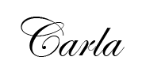

<h1 align="center">🌟🌐💻✈️ My Personal Portfolio 💡✍️🎨🌟</h1>

&nbsp;&nbsp;&nbsp;&nbsp; Welcome to my personal portfolio! This project showcases some of my technical skills in a clean and modern design. Built with accessibility and responsiveness in mind, this site is designed to look great on all devices📱💻🎨✨

## 📖 Overview

&nbsp;&nbsp;&nbsp;&nbsp; This portfolio was created using a [Figma template](https://www.figma.com/design/GcXrhyHfbBVzSsRHPcTmRh/Curriculum---Web---Student-Portfolio-Template?node-id=3569-356&p=f) as a base, with my own choice of colors and fonts to give it a unique touch. The goal was to build a professional, yet personal space to display my projects and achievements.

## ✨ Features:

-   **Fully responsive design** (mobile-first approach 📱➡️💻)
-   **Semantic HTML** for better structure and accessibility
-   Styled using **SCSS** with **BEM methodology** for maintainable **CSS**
-   **Flexbox** used for general layout and responsiveness
-   **CSS Grid** used to display portfolio projects in an organized way
-   Custom fonts imported via **Google Fonts API**
-   Deployed via **GitHub Pages** for easy access
-   Clean, readable, and well-organized code structure

## ✍️ Project Setup

To ensure a smooth development process, I followed these steps to set up and work with the project:

**1️⃣ Install SASS Globally** (if not installed)

SCSS needs to be compiled into CSS before it can be used in the project. If you haven't installed SASS yet, run the following **Bash command**:

```
npm install -g sass
```

**2️⃣ Compile SCSS into CSS**

Inside your project directory, run the following command to watch your SCSS files and automatically compile them into CSS:

```
sass --watch styles.scss styles.css
```

This will generate a CSS file from SCSS and continuously watch for any changes.

**3️⃣ Link the Compiled CSS in HTML**
Ensure that your HTML file is linked to the compiled CSS file (not the SCSS file):

```
<link rel="stylesheet" href="./styles.css">
```

## 💻 Technologies Used

-   **HTML5** – Structured the content for a logical webpage flow from top to bottom
-   **SCSS** – Used for styling with better organization and maintainability
-   **BEM (Block Element Modifier)** – Followed BEM methodology for clear, modular, and reusable CSS
-   **CSS Flexible Box Layout** – Used for layout flexibility and responsiveness
-   **CSS Grid** - To align elements
-   **Google Fonts API** – Imported custom fonts to enhance typography
-   **Markdown** syntax for README
-   **Git and Bash** - Used for version control, managing commits and repository updates
-   **GitHub Pages** – For hosting and deployment

## 🚀 Deployment

-   In the Portfolio repository, **Settings - Pages - Build and deployment**;
-   Selected correct branch -**main** and **/(root)** as the folder;
-   **Cleared caches** in browser and **refreshed page** - Portfolio available ☑️

## 🪄 Future Enhancements

-   Enhancing user engagement by incorporating interactive elements using JavaScript, TypeScript, and other technologies I've learned.
-   Optimizing performance for faster load times.
-   Deploying the Portfolio on my own domain for a more professional and personalized web presence.

## 🤝 Contributions and Feedback

While this is a personal project, I’d love feedback and suggestions! Feel free to open an issue or reach out.

### 🙏 Thanks for stopping by,

<p align="center"></p>
